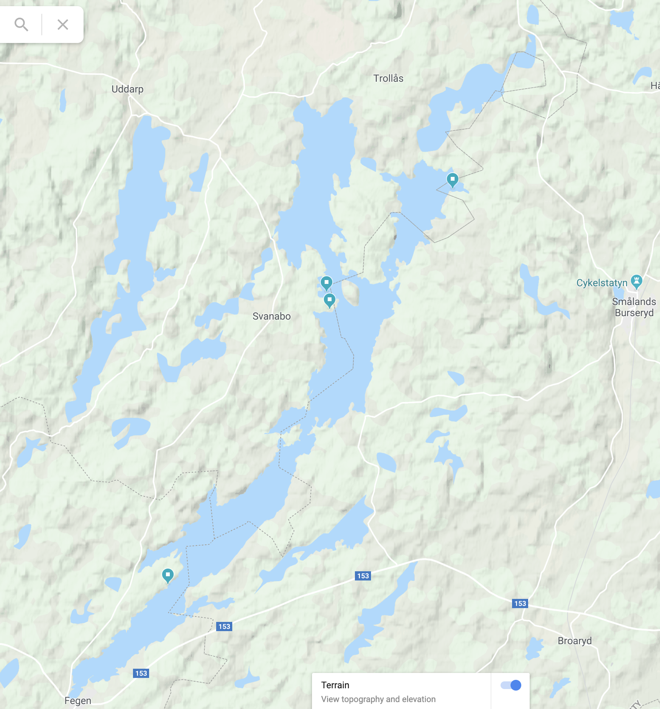

# Vandretur Fegen rundt

## Kort beskrivelse

* __Område__: Omkring søen Fegen i Hallands Len — nordlig højde om Aalborg
* __Længde:__ ca. 67 km
* __Datoer:__ Torsdag 30. April (morgen/formiddag) – Søndag 2. Maj (eftermiddag/tidlig aften) — altså to hele og to halve vandredage
* __Start- og slutsted:__ Fegen, Sverige (by)

Vi skal tilbagelægge en god distance omkring søen Fegen, og turen bliver halv-hård.
Tærænnet er let på østsiden, hvor vi kan følge en markeret sti (Gisavleden), men på vestsiden er der ingen markeret rute — ved at søge mod vest støder man dog på en landevej, som kan følges hvis det bliver nødvendigt.

Der er tre shelterpladser på østsiden af søen Fegen, og én på vestsiden i den nordlige ende, men da de deles med kano-folket, kan man ikke være sikker på at de er ledige.
Vi skal under alle omstændighedder have telte med.

## Forventningsafstemning

Vi skal gå ontrent 11 km på de halve vandredage og 22 km på de fulde vandredage.

Turen bliver en af de lidt hårdere, da vi skal gå en pæn distance hver dag.
Vi skal nok være opmærksomme på at det nok tager længere tid at gå distancen på østsiden grundet tærænnet.
Vi ønsker dog også at have tid til at spise frokost uden at skynde os, samt tid til at hygge i lejren.
For at nå dette siger vi efter en tidlig afgang om morgnen, og efter hurtigt at få lejr-tjanserne fordelt mellem folk, så flere opgaver varetages samtidig.

## Praktisk

### Afgang og transport

Vi tager afsted om morgenen eller tidlig formiddag torsdag d. 30 Maj (Kristi Himmelfartsdag).

Man er selv ansvarlig for at komme til startstedet, men vi satser på at tage afsted sammen så vidt muligt.
Det kan dog ikke udelukkes at nogen kører i bil, mens andre tager det offentlige.

Turen tager ca. 4 timer og 20 minutter med offentlig transport, mod 2 timer og 50 minutter i bil.

### Fællesgrej

Vi deles om telte og kogegrej.

#### Hvad har vi af telte?

* _Allan:_ 2-personers telt + tre-personers (komfortablet for 2, kan klare 4 hvis en del af forteltet tages i brug).
* _Kasper:_ 3-personers telt, (komfortablet for 2, kan klare 4 hvis en del af forteltet tages i brug).

Altså har vi telt-kapacitet til 6 til 10 mand.

Vi har kogegrej nok, og tager muligvis også et vandfilter med.

### Proviant
Vi har fælles morgenmad og aftensmad — man skal selv stå for frokost.

Indkøb ad madvarer koordineres på et senere tidspunkt.

#### Morgenmad

Havregrød alle dage.
Indhold:

* Havregryn
* Salt
* Rosiner

Til første morgenmad laver vi muligvis supplerende røræg og bacon (bacontern).

#### Aftensmad

Vi har tre aftensmåltider.

1. Butter chicken med ris (Butterchicken købes i supermarkedet)
2. Pasta, pesto, parmesan, majs, chili, champignon, hvidløg.
3. Ris, karry, mælkepulver, chili, kylling (hvis muligt at få det tørret), evt. champignon.

### Shelter koordinater

1. Backa, WGS84 `N 57.202862, E 13.146844`
2. Backa S, WGS84 `N 57.198751, E 13.148357`
3. Boberg, WGS84, `N 57.227628, E 13.202755`
4. Ramsäng, WGS84, `N 57.132736, E 13.076669`

